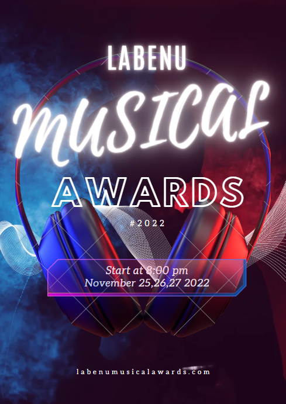

<h1 align="center">
 🎵 Projeto - O LAMA 🎵
</h1>
 

</h1>

 

## 🧠 Contexto

 

O projeto é um sistema interno de um novo festival de música, então sejam bem-vindos ao **LAMA**.

 

- 🎯 Objetivo do Projeto
- 📌 Funcionalidades
- 🎯 Requesitos Mínimos
- 📚 Aprendizado
- 🛠️ Tecnologias Utilizadas
- 📦 Pacotes Utilizados
- ⚙️ Como rodar o projeto localmente
- 🔃 Rotas
- ✨ O que funciona
- 👨‍💻 Desenvolvedor(a)

 

## 🎯 Objetivo do Projeto

O **LAMA**, _Labenu Musical Awards_, um festival com várias bandas famosas para a formatura da sua turma que ocorrerá em um final de semana na Sexta, Sábado e Domingo, no final, vocês podem eleger a banda que mais gostaram! Entretanto vocês só serão merecedores se entregarem um sistema impecável que permita o gerenciamento completo desses shows.

Este é um projeto elaborado em equipe que busca reproduzir as funcionalidades de um sistema para o gerenciamento completo de shows musicais. Consistindo basicamente no desenvolvimento de um backend voltado para um padrão de arquitetura de microserviços e integrado com o banco de dados MySql.

Continua...
